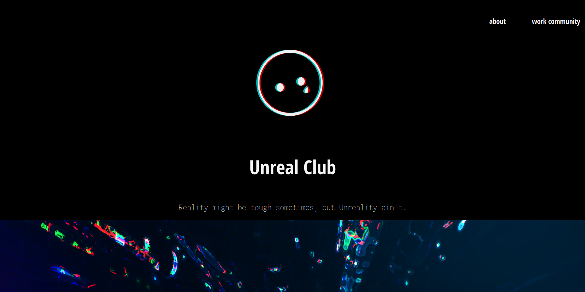
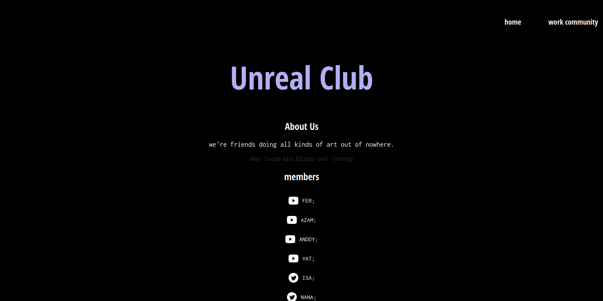
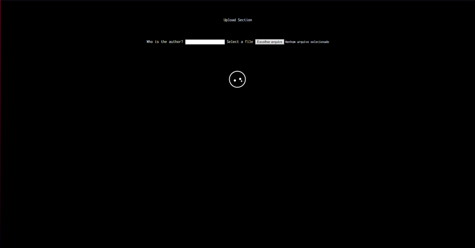

# Unreal Club Project

[](https://github.com/SaLandini/unreal-club/blob/master/LICENSE)

This project is a way to publicize the work of the members of Unreal Club and the club.

## the app

At this moment, the project are build with ReactJS( front-end ) and Flask( back-end ). 

### Back-end

### Front-end

so if you clone this project first you will need to have yarn installed in your pc and install the dependencies ( you will find at [package.json file](unreal-web/package.json) ). after that, you will start the app using:

```yarn
yarn start
```

## images of project

- home:



- about:



- upload:



> At this moments, just those pages are done

## author

- Rafael Salandin - _Developer & Someone_ - [GitHub](https://github.com/SaLandini) | [Twitter](https://twitter.com/Rafaelsm_f95)

## unreal club

[YouTube](https://www.youtube.com/channel/UCiKshD8J1ZotpXJmX5ysCgQ) <br>
[Instagram](https://www.instagram.com/unreal.club/)
____